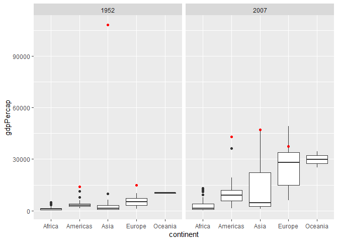
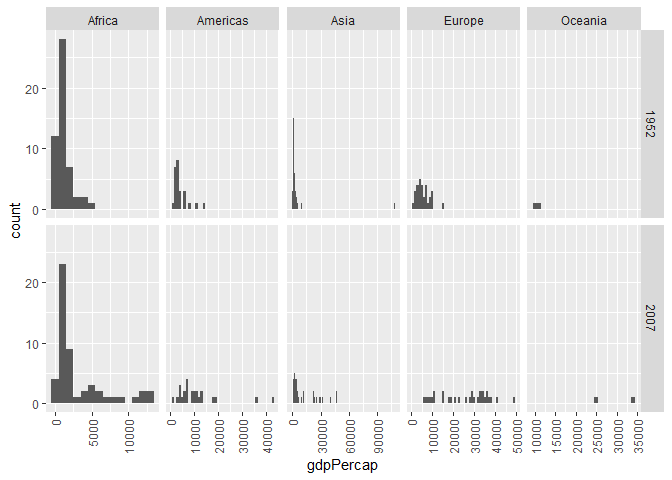
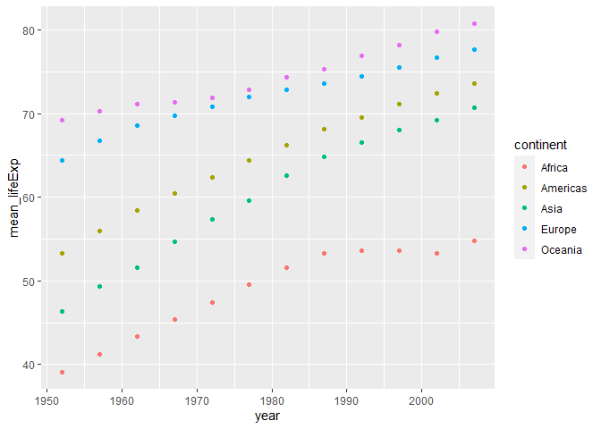
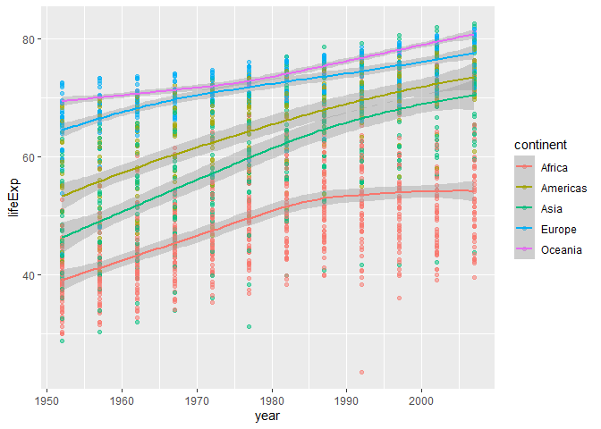
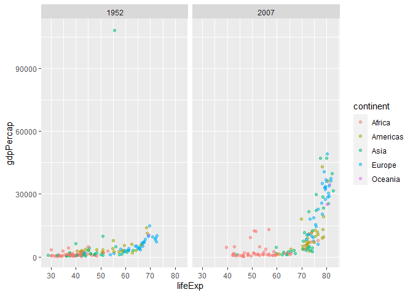
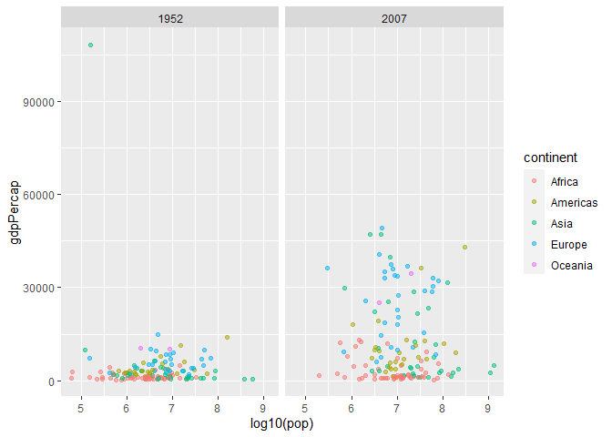

Gapminder
================
Mason del Rosario
2020-07-25

  - [Grading Rubric](#grading-rubric)
  - [Guided EDA](#guided-eda)
  - [Your Own EDA](#your-own-eda)
      - [1. How has life expectancy changed over time per
        continent?](#how-has-life-expectancy-changed-over-time-per-continent)
      - [2. What relationship do `gdpPercap` and `lifeExp`
        have?](#what-relationship-do-gdppercap-and-lifeexp-have)
      - [3. What relationship do `gdpPercap` and `pop`
        have?](#what-relationship-do-gdppercap-and-pop-have)

*Purpose*: Learning to do EDA well takes practice\! In this challenge
you’ll further practice EDA by first completing a guided exploration,
then by conducting your own investigation. This challenge will also give
you a chance to use the wide variety of visual tools we’ve been
learning.

<!-- include-rubric -->

# Grading Rubric

<!-- -------------------------------------------------- -->

<!-- Unlike exercises, **challenges will be graded**. The following rubrics define how you will be graded, both on an individual and team basis. -->

<!-- ## Individual -->

<!-- ------------------------- -->

<!-- | Category | Unsatisfactory | Satisfactory | -->

<!-- |----------|----------------|--------------| -->

<!-- | Effort | Some task __q__'s left unattempted | All task __q__'s attempted | -->

<!-- | Observed | Did not document observations | Documented observations based on analysis | -->

<!-- | Supported | Some observations not supported by analysis | All observations supported by analysis (table, graph, etc.) | -->

<!-- | Code Styled | Violations of the [style guide](https://style.tidyverse.org/) hinder readability | Code sufficiently close to the [style guide](https://style.tidyverse.org/) | -->

<!-- ## Team -->

<!-- <!-- ------------------------- -->

<!-- | Category | Unsatisfactory | Satisfactory | -->

<!-- |----------|----------------|--------------| -->

<!-- | Documented | No team contributions to Wiki | Team contributed to Wiki | -->

<!-- | Referenced | No team references in Wiki | At least one reference in Wiki to member report(s) | -->

<!-- | Relevant | References unrelated to assertion, or difficult to find related analysis based on reference text | Reference text clearly points to relevant analysis | -->

<!-- ## Due Date -->

<!-- <!-- ------------------------- -->

<!-- All the deliverables stated in the rubrics above are due on the day of the class discussion of that exercise. See the [Syllabus](https://docs.google.com/document/d/1jJTh2DH8nVJd2eyMMoyNGroReo0BKcJrz1eONi3rPSc/edit?usp=sharing) for more information. -->

``` r
library(tidyverse)
```

    ## -- Attaching packages --------------------------------------- tidyverse 1.3.0 --

    ## v ggplot2 3.3.2     v purrr   0.3.4
    ## v tibble  3.0.1     v dplyr   1.0.0
    ## v tidyr   1.1.0     v stringr 1.4.0
    ## v readr   1.3.1     v forcats 0.5.0

    ## -- Conflicts ------------------------------------------ tidyverse_conflicts() --
    ## x dplyr::filter() masks stats::filter()
    ## x dplyr::lag()    masks stats::lag()

``` r
library(gapminder)
```

*Background*: [Gapminder](https://www.gapminder.org/about-gapminder/) is
an independent organization that seeks to education people about the
state of the world. They promote a “fact-based worldview” by focusing on
data. The dataset we’ll study in this challenge is from Gapminder.

# Guided EDA

<!-- -------------------------------------------------- -->

First, we’ll go through a round of *guided EDA*. Try to pay attention to
the high-level process we’re going through—after this guided round
you’ll be responsible for doing another cycle of EDA on your own\!

**q0** Perform your “first checks” on the dataset. What variables are in
this dataset?

``` r
## TASK: Do your "first checks" here!
glimpse(gapminder)
```

    ## Rows: 1,704
    ## Columns: 6
    ## $ country   <fct> Afghanistan, Afghanistan, Afghanistan, Afghanistan, Afgha...
    ## $ continent <fct> Asia, Asia, Asia, Asia, Asia, Asia, Asia, Asia, Asia, Asi...
    ## $ year      <int> 1952, 1957, 1962, 1967, 1972, 1977, 1982, 1987, 1992, 199...
    ## $ lifeExp   <dbl> 28.801, 30.332, 31.997, 34.020, 36.088, 38.438, 39.854, 4...
    ## $ pop       <int> 8425333, 9240934, 10267083, 11537966, 13079460, 14880372,...
    ## $ gdpPercap <dbl> 779.4453, 820.8530, 853.1007, 836.1971, 739.9811, 786.113...

``` r
summary(gapminder)
```

    ##         country        continent        year         lifeExp     
    ##  Afghanistan:  12   Africa  :624   Min.   :1952   Min.   :23.60  
    ##  Albania    :  12   Americas:300   1st Qu.:1966   1st Qu.:48.20  
    ##  Algeria    :  12   Asia    :396   Median :1980   Median :60.71  
    ##  Angola     :  12   Europe  :360   Mean   :1980   Mean   :59.47  
    ##  Argentina  :  12   Oceania : 24   3rd Qu.:1993   3rd Qu.:70.85  
    ##  Australia  :  12                  Max.   :2007   Max.   :82.60  
    ##  (Other)    :1632                                                
    ##       pop              gdpPercap       
    ##  Min.   :6.001e+04   Min.   :   241.2  
    ##  1st Qu.:2.794e+06   1st Qu.:  1202.1  
    ##  Median :7.024e+06   Median :  3531.8  
    ##  Mean   :2.960e+07   Mean   :  7215.3  
    ##  3rd Qu.:1.959e+07   3rd Qu.:  9325.5  
    ##  Max.   :1.319e+09   Max.   :113523.1  
    ## 

**Observations**:

  - Country, continent, year, lifeExp, pop, gdpPercap

**q1** Determine the most and least recent years in the `gapminder`
dataset.

``` r
## TASK: Find the largest and smallest values of `year` in `gapminder`
year_sum <-
  gapminder %>%
  summarise(min_year = min(year), max_year = max(year))
year_max <- year_sum$max_year
year_min <- year_sum$min_year
```

Use the following test to check your work.

``` r
## NOTE: No need to change this
assertthat::assert_that(year_max %% 7 == 5)
```

    ## [1] TRUE

``` r
assertthat::assert_that(year_max %% 3 == 0)
```

    ## [1] TRUE

``` r
assertthat::assert_that(year_min %% 7 == 6)
```

    ## [1] TRUE

``` r
assertthat::assert_that(year_min %% 3 == 2)
```

    ## [1] TRUE

``` r
print("Nice!")
```

    ## [1] "Nice!"

**q2** Filter on years matching `year_min`, and make a plot of the GDE
per capita against continent. Choose an appropriate `geom_` to visualize
the data. What observations can you make?

You may encounter difficulties in visualizing these data; if so document
your challenges and attempt to produce the most informative visual you
can.

``` r
## TASK: Create a visual of gdpPercap vs continent
gapminder %>%
  filter(year == year_min) %>%
  filter(gdpPercap < 90000) %>% # bad form, but makes it easy to comment out outlier filter
  ggplot(aes(x = continent, y = gdpPercap)) +
  geom_boxplot()
```

<!-- -->

``` r
gapminder %>%
  filter(year == year_min) %>%
  # filter(gdpPercap < 90000) %>% # bad form, but makes it easy to comment out outlier filter
  ggplot(aes(x = gdpPercap)) +
  geom_histogram(binwidth = 1000) +
  facet_wrap(~ continent, scales = "free_x")
```

<!-- -->

**Observations**:

  - `geom_boxplot` - There is a *severe* outlier in `Asia` which makes
    the y-axis difficult to parse.
      - Looks like it was Kuwait, which has the [highest valued currency
        in the world](https://en.wikipedia.org/wiki/Kuwaiti_dinar).

**Difficulties & Approaches**:

  - Outliers made the histograms sparse. The `scales = free_x` for
    `facet_wrap` helps.
  - Outliers made the vanilla boxplot uniformative – filtering out the
    outliers makes the distribution easier to interpret.

**q3** You should have found at least three outliers in q2. Identify
those outliers (figure out which countries they are).

``` r
## TASK: Identify the outliers from q2
outliers <-
  gapminder %>%
  filter(year == year_min) %>%
  filter(gdpPercap > 12000)
outliers
```

    ## # A tibble: 3 x 6
    ##   country       continent  year lifeExp       pop gdpPercap
    ##   <fct>         <fct>     <int>   <dbl>     <int>     <dbl>
    ## 1 Kuwait        Asia       1952    55.6    160000   108382.
    ## 2 Switzerland   Europe     1952    69.6   4815000    14734.
    ## 3 United States Americas   1952    68.4 157553000    13990.

**Observations**:

  - For Kuwait and Switzerland, the large `gdpPercap` can be (partially)
    attributed to their small populations (160000 and 4815000,
    respectively).
  - The other outlier is the United States.

**q4** Create a plot similar to yours from q2 studying both `year_min`
and `year_max`. Find a way to highlight the outliers from q3 on your
plot. Compare the patterns between `year_min` and `year_max`.

*Hint*: We’ve learned a lot of different ways to show multiple
variables; think about using different aesthetics or facets.

``` r
## TASK: Create a visual of gdpPercap vs continent
outliers_all <-
  gapminder %>%
  filter(country %in% outliers$country, year %in% c(year_min, year_max))
outliers_all
```

    ## # A tibble: 6 x 6
    ##   country       continent  year lifeExp       pop gdpPercap
    ##   <fct>         <fct>     <int>   <dbl>     <int>     <dbl>
    ## 1 Kuwait        Asia       1952    55.6    160000   108382.
    ## 2 Kuwait        Asia       2007    77.6   2505559    47307.
    ## 3 Switzerland   Europe     1952    69.6   4815000    14734.
    ## 4 Switzerland   Europe     2007    81.7   7554661    37506.
    ## 5 United States Americas   1952    68.4 157553000    13990.
    ## 6 United States Americas   2007    78.2 301139947    42952.

``` r
gapminder %>%
  filter(year == year_min | year == year_max) %>%
  ggplot(aes(x = continent, y = gdpPercap)) +
  geom_boxplot() +
  geom_point(data = outliers_all, aes(x = continent, y = gdpPercap), color = 'red')+
  facet_wrap(~ year)
```

<!-- -->

``` r
gapminder %>%
  filter(year == year_min | year == year_max) %>%
  ggplot(aes(x = gdpPercap)) +
  geom_histogram(binwidth = 1000) +
  facet_grid(year ~ continent, scales = "free_x") +
  theme(axis.text.x = element_text(angle = 90, vjust = 0.5, hjust=1))
```

<!-- -->

**Observations**:

  - In aggregate, `gdpPercap` increased from `year_min` to `year_max`.
  - The only outlier from `year_min` that is still an outlier in
    `year_max` is the United States – Kuwait and Switzerland now fall
    within the 1.5 IQR of their respective continental distributions.
  - The continent-wise distributions have spread out more (i.e., the
    IQRs span a larger range of `gdpPercap`).
      - This might mean that certain countries are pulling far ahead of
        others in economic producitivity.

# Your Own EDA

<!-- -------------------------------------------------- -->

Now it’s your turn\! We just went through guided EDA considering the GDP
per capita at two time points. You can continue looking at outliers,
consider different years, repeat the exercise with `lifeExp`, consider
the relationship between variables, or something else entirely.

**q5** Create *at least* three new figures below. With each figure, try
to pose new questions about the data.

## 1\. How has life expectancy changed over time per continent?

``` r
## TASK: Your first graph
gapminder %>%
  group_by(continent, year) %>%
  summarize(mean_lifeExp = mean(lifeExp)) %>%
  ggplot() +
  geom_point(aes(x = year, y = mean_lifeExp, color = continent))
```

    ## `summarise()` regrouping output by 'continent' (override with `.groups` argument)

<!-- -->

``` r
gapminder %>%
  group_by(continent, year) %>%
  ggplot(aes(x = year, y = lifeExp, color = continent)) +
  geom_point(alpha = 0.5) +
  geom_smooth()
```

    ## `geom_smooth()` using method = 'loess' and formula 'y ~ x'

<!-- -->
**Observations**:

  - Mean `lifeExp` has increased monotonically for every continent…
      - …but Africa still lags behind other continents. In the 90’s,
        Africa’s mean life expectancy plateaued (decreased?) until 2007.

## 2\. What relationship do `gdpPercap` and `lifeExp` have?

``` r
## TASK: Your second graph
gapminder %>%
  filter(year %in% c(year_min, year_max)) %>%
  ggplot(aes(x = lifeExp, y = gdpPercap, color = continent)) +
  geom_point(alpha = 0.5) +
  facet_wrap(~ year)
```

<!-- -->

**Observations**:

  - Epistemic status: moderate confidence. There is an exponential
    relationship between `lifeExp` and `gdpPercap`.
      - Hypothesis: The longer people live, the more productive they
        are.
      - But correlation \!= causation, and economies are complex
        systems.

## 3\. What relationship do `gdpPercap` and `pop` have?

``` r
## TASK: Your third graph
gapminder %>%
  filter(year %in% c(year_min, year_max)) %>%
  ggplot(aes(x = log10(pop), y = gdpPercap, color = continent)) +
  geom_point(alpha = 0.5) +
  facet_wrap(~ year)
```

<!-- -->

**Observation**:

  - Larger populations do not imply larger `gdpPercap`…
      - …which should be obvious. `Percap` implies population-normalized
        data.
