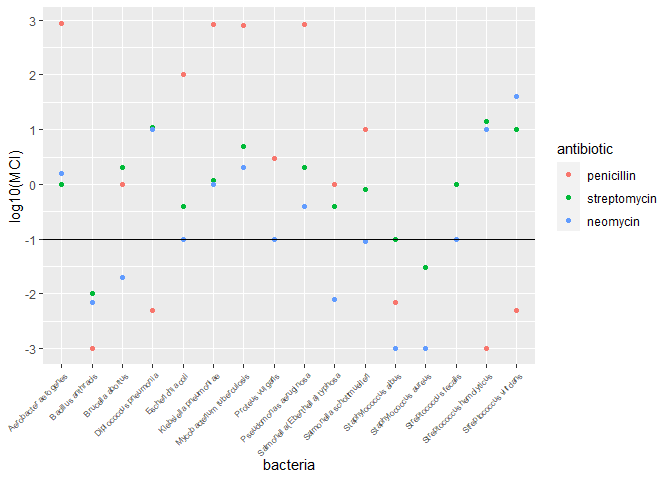
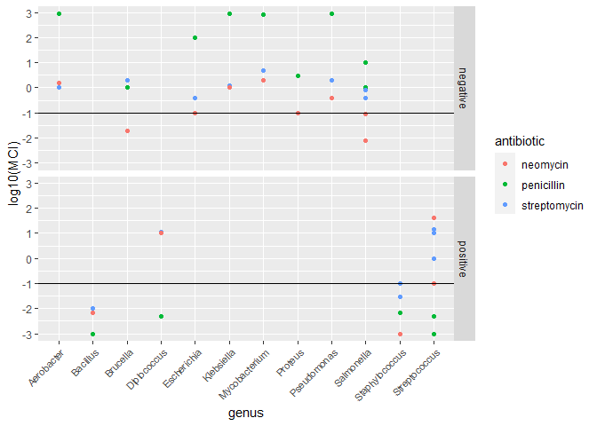

Antibiotics
================
(Your name here)
2020-

  - [Visualization](#visualization)
      - [Purpose: Compare Effectiveness](#purpose-compare-effectiveness)
      - [Purpose: Categorize Bacteria](#purpose-categorize-bacteria)
  - [References](#references)

*Purpose*: To create an effective visualization, we need to keep our
*purpose* firmly in mind. There are many different ways to visualize
data, and the only way we can judge efficacy is with respect to our
purpose.

In this challenge you’ll visualize the same data in two different ways,
aimed at two different purposes.

*Note*: Please complete your initial visual design **alone**. Work on
both of your graphs alone, and save a version to your repo *before*
coming together with your team. This way you can all bring a diversity
of ideas to the table\!

``` r
library(tidyverse)
```

    ## -- Attaching packages ------------------------------ tidyverse 1.3.0 --

    ## v ggplot2 3.3.2     v purrr   0.3.4
    ## v tibble  3.0.1     v dplyr   1.0.0
    ## v tidyr   1.1.0     v stringr 1.4.0
    ## v readr   1.3.1     v forcats 0.5.0

    ## -- Conflicts --------------------------------- tidyverse_conflicts() --
    ## x dplyr::filter() masks stats::filter()
    ## x dplyr::lag()    masks stats::lag()

``` r
library(ggrepel)
```

*Background*: The data\[1\] we study in this challenge report the
[*minimum inhibitory
concentration*](https://en.wikipedia.org/wiki/Minimum_inhibitory_concentration)
(MIC) of three drugs for different bacteria. The smaller the MIC for a
given drug and bacteria pair, the more practical the drug is for
treating that particular bacteria. An MIC value of *at most* 0.1 is
considered necessary for treating human patients.

These data report MIC values for three antibiotics—penicillin,
streptomycin, and neomycin—on 16 bacteria. Bacteria are categorized into
a genus based on a number of features, including their resistance to
antibiotics.

``` r
## NOTE: If you extracted all challenges to the same location,
## you shouldn't have to change this filename
filename <- "./data/antibiotics.csv"

## Load the data
df_antibiotics <- read_csv(filename)
```

    ## Parsed with column specification:
    ## cols(
    ##   bacteria = col_character(),
    ##   penicillin = col_double(),
    ##   streptomycin = col_double(),
    ##   neomycin = col_double(),
    ##   gram = col_character()
    ## )

``` r
df_antibiotics %>% knitr::kable()
```

| bacteria                        | penicillin | streptomycin | neomycin | gram     |
| :------------------------------ | ---------: | -----------: | -------: | :------- |
| Aerobacter aerogenes            |    870.000 |         1.00 |    1.600 | negative |
| Brucella abortus                |      1.000 |         2.00 |    0.020 | negative |
| Bacillus anthracis              |      0.001 |         0.01 |    0.007 | positive |
| Diplococcus pneumonia           |      0.005 |        11.00 |   10.000 | positive |
| Escherichia coli                |    100.000 |         0.40 |    0.100 | negative |
| Klebsiella pneumoniae           |    850.000 |         1.20 |    1.000 | negative |
| Mycobacterium tuberculosis      |    800.000 |         5.00 |    2.000 | negative |
| Proteus vulgaris                |      3.000 |         0.10 |    0.100 | negative |
| Pseudomonas aeruginosa          |    850.000 |         2.00 |    0.400 | negative |
| Salmonella (Eberthella) typhosa |      1.000 |         0.40 |    0.008 | negative |
| Salmonella schottmuelleri       |     10.000 |         0.80 |    0.090 | negative |
| Staphylococcus albus            |      0.007 |         0.10 |    0.001 | positive |
| Staphylococcus aureus           |      0.030 |         0.03 |    0.001 | positive |
| Streptococcus fecalis           |      1.000 |         1.00 |    0.100 | positive |
| Streptococcus hemolyticus       |      0.001 |        14.00 |   10.000 | positive |
| Streptococcus viridans          |      0.005 |        10.00 |   40.000 | positive |

# Visualization

<!-- -------------------------------------------------- -->

## Purpose: Compare Effectiveness

<!-- ------------------------- -->

**q1** Create a visualization of `df_antibiotics` that helps you to
compare the effectiveness of the three antibiotics across all the
bacteria reported. Can you make any broad statements about antibiotic
effectiveness?

``` r
library(reshape2)
```

    ## 
    ## Attaching package: 'reshape2'

    ## The following object is masked from 'package:tidyr':
    ## 
    ##     smiths

``` r
df_antibiotics.melt <- 
  melt(df_antibiotics, id = "bacteria", variable.name = "antibiotic", value.name = "MCI") %>%
  filter(antibiotic %in% c("penicillin",    "streptomycin", "neomycin")) %>%
  transform(MCI = as.numeric(MCI)) 

df_antibiotics.melt %>%
  ggplot() +
  geom_point(aes(x = bacteria, y = log10(MCI), color = antibiotic)) +
  geom_hline(yintercept = -1) +
  theme(axis.text.x = element_text(angle = 45,  hjust=1, size = 6))
```

<!-- -->

``` r
df_antibiotics.melt %>%
  filter(MCI <= 0.1) %>%
  group_by(antibiotic) %>%
  summarise(n_usable = n())
```

    ## `summarise()` ungrouping output (override with `.groups` argument)

    ## # A tibble: 3 x 2
    ##   antibiotic   n_usable
    ##   <fct>           <int>
    ## 1 penicillin          6
    ## 2 streptomycin        4
    ## 3 neomycin            9

**Observations**:

  - *Note*: An antibiotic is effective if it falls below the black line
    (`MCI <= 0.1`).
  - Neomycin appears to be usable for the most bacteria (9) of the three
    antibiotics.

## Purpose: Categorize Bacteria

<!-- ------------------------- -->

The *genus* of a living organism is a human categorization, based on
various characteristics of the organism. Since these categories are
based on numerous factors, we will tend to see clusters if we visualize
data according to relevant variables. We can use these visuals to
categorize observations, and to question whether given categories are
reasonable\!

**q2** Create a visualization of `df_antibiotics` that helps you to
categorize bacteria according to the variables in the data. Document
your observations on how how clusters of bacteria in the variables do—or
don’t—align with their *genus* classification.

``` r
# split bacteria col
df_genera <-
df_antibiotics %>%
  pivot_longer(
    names_to = "antibiotic",
    values_to = "MCI",
    cols = c("penicillin",  "streptomycin", "neomycin")
  ) %>%
  separate(bacteria, c("genus", "species"), " ")
```

    ## Warning: Expected 2 pieces. Additional pieces discarded in 3 rows [28, 29, 30].

``` r
df_genera %>%
  ggplot(aes(x = genus, y = log10(MCI), color = antibiotic)) +
  geom_point() +
  geom_hline(yintercept = -1) +
  theme(axis.text.x = element_text(angle = 45,  hjust=1, size = 8)) +
  facet_grid(gram ~ .)
```

<!-- -->

``` r
# summarize genus-wise MCI
df_genera %>%
  filter(MCI <= 0.1) %>%
  group_by(genus, gram) %>%
  summarise(n_usable = n())
```

    ## `summarise()` regrouping output by 'genus' (override with `.groups` argument)

    ## # A tibble: 8 x 3
    ## # Groups:   genus [8]
    ##   genus          gram     n_usable
    ##   <chr>          <chr>       <int>
    ## 1 Bacillus       positive        3
    ## 2 Brucella       negative        1
    ## 3 Diplococcus    positive        1
    ## 4 Escherichia    negative        1
    ## 5 Proteus        negative        2
    ## 6 Salmonella     negative        2
    ## 7 Staphylococcus positive        6
    ## 8 Streptococcus  positive        3

**Observations**:

  - *Effect of Genus*: Genera with impractically high MCI for all
    antibiotics:
      - Aerobacter, Escherichia, Klebsiella, Mycobacterium, Pseudomonas
  - *Effect of Gram*: Among bacteria that are susceptible to the
    antibiotics, `gram = positive` bacteria fall under the `MCI`
    threshold more often.

# References

<!-- -------------------------------------------------- -->

\[1\] Neomycin in skin infections: A new topical antibiotic with wide
antibacterial range and rarely sensitizing. Scope. 1951;3(5):4-7.

\[2\] Wainer and Lysen, “That’s Funny…” /American Scientist/ (2009)
[link](https://www.americanscientist.org/article/thats-funny)
