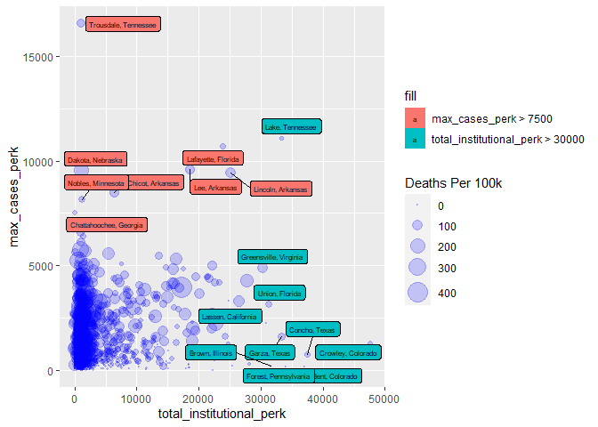
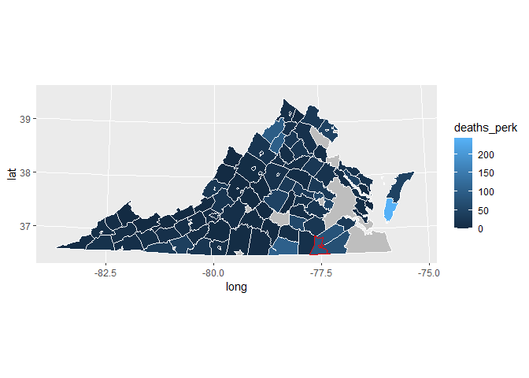
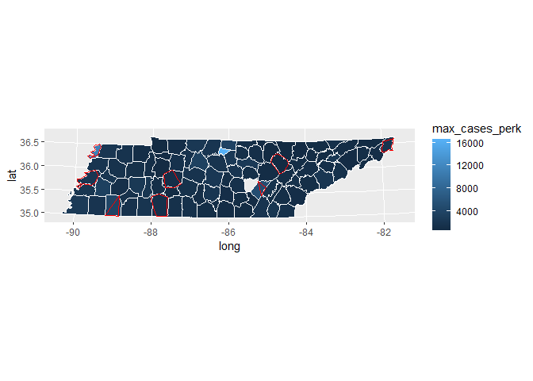
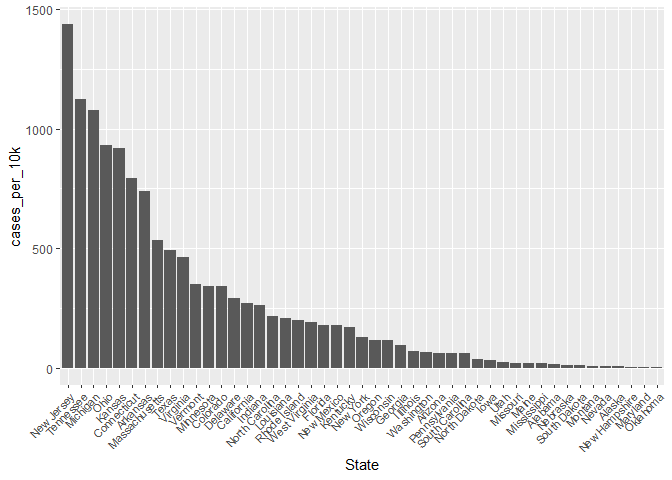
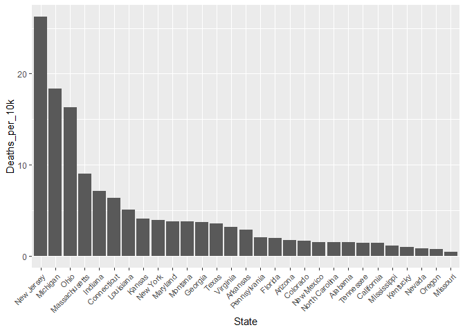
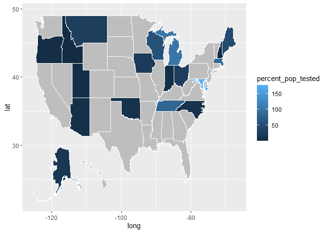
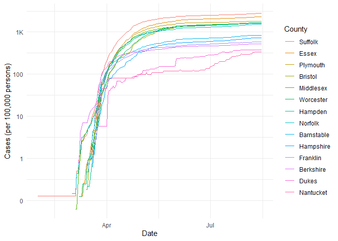

COVID-19
================
(Your name here)
2020-

  - [Grading Rubric](#grading-rubric)
      - [Individual](#individual)
      - [Team](#team)
      - [Due Date](#due-date)
  - [The Big Picture](#the-big-picture)
  - [Get the Data](#get-the-data)
      - [Get Census Data of Population](#get-census-data-of-population)
      - [Automated Download of NYT
        Data](#automated-download-of-nyt-data)
  - [Join the Data](#join-the-data)
  - [Analyze](#analyze)
      - [Normalize](#normalize)
      - [Guided EDA](#guided-eda)
      - [Self-directed EDA](#self-directed-eda)
      - [Investigating Institutional
        Data](#investigating-institutional-data)
      - [Virginia Institutional Case
        Counts](#virginia-institutional-case-counts)
      - [Tennessee Institutional Case
        Counts](#tennessee-institutional-case-counts)
      - [Summary of COVID Cases in Prisons per
        State](#summary-of-covid-cases-in-prisons-per-state)
  - [`{r policy-case-fatality-rate} # df_prison_covid %>% #
    filter(Deaths_per_confirmed_case > 0) %>% #
    mutate(case_fatality_rate = as.numeric(sub("%", "",
    Deaths_per_confirmed_case))) %>% # arrange(desc(case_fatality_rate))
    %>% # ggplot() + # geom_bar(mapping = aes(x = reorder(State,
    -case_fatality_rate), case_fatality_rate), stat = "identity") + #
    theme(axis.text.x = element_text(angle = 45, hjust=1, size = 7)) + #
    labs(x = "State", y = "Case Fatality Rate [%]")
    #`](#r-policy-case-fatality-rate-df_prison_covid-filterdeaths_per_confirmed_case-0-mutatecase_fatality_rate-as.numericsub-deaths_per_confirmed_case-arrangedesccase_fatality_rate-ggplot-geom_barmapping-aesx-reorderstate--case_fatality_rate-case_fatality_rate-stat-identity-themeaxis.text.x-element_textangle-45-hjust1-size-7-labsx-state-y-case-fatality-rate)
      - [Aside: Some visualization
        tricks](#aside-some-visualization-tricks)
      - [Geographic exceptions](#geographic-exceptions)
  - [Notes](#notes)

*Purpose*: We can’t *possibly* do a class on data science and *not* look
at covid-19. Come on.

In this challenge, you’ll learn how to navigate the U.S. Census Bureau
website, programmatically download data from the internet, and perform a
county-level population-weighted analysis of current covid-19 trends.
Get excited\!

<!-- include-rubric -->

# Grading Rubric

<!-- -------------------------------------------------- -->

Unlike exercises, **challenges will be graded**. The following rubrics
define how you will be graded, both on an individual and team basis.

## Individual

<!-- ------------------------- -->

| Category    | Unsatisfactory                                                                   | Satisfactory                                                               |
| ----------- | -------------------------------------------------------------------------------- | -------------------------------------------------------------------------- |
| Effort      | Some task **q**’s left unattempted                                               | All task **q**’s attempted                                                 |
| Observed    | Did not document observations                                                    | Documented observations based on analysis                                  |
| Supported   | Some observations not supported by analysis                                      | All observations supported by analysis (table, graph, etc.)                |
| Code Styled | Violations of the [style guide](https://style.tidyverse.org/) hinder readability | Code sufficiently close to the [style guide](https://style.tidyverse.org/) |

## Team

<!-- ------------------------- -->

| Category   | Unsatisfactory                                                                                   | Satisfactory                                       |
| ---------- | ------------------------------------------------------------------------------------------------ | -------------------------------------------------- |
| Documented | No team contributions to Wiki                                                                    | Team contributed to Wiki                           |
| Referenced | No team references in Wiki                                                                       | At least one reference in Wiki to member report(s) |
| Relevant   | References unrelated to assertion, or difficult to find related analysis based on reference text | Reference text clearly points to relevant analysis |

## Due Date

<!-- ------------------------- -->

All the deliverables stated in the rubrics above are due on the day of
the class discussion of that exercise. See the
[Syllabus](https://docs.google.com/document/d/1jJTh2DH8nVJd2eyMMoyNGroReo0BKcJrz1eONi3rPSc/edit?usp=sharing)
for more information.

``` r
library(tidyverse)
```

    ## -- Attaching packages ----------------------------------------- tidyverse 1.3.0 --

    ## v ggplot2 3.3.2     v purrr   0.3.4
    ## v tibble  3.0.1     v dplyr   1.0.0
    ## v tidyr   1.1.0     v stringr 1.4.0
    ## v readr   1.3.1     v forcats 0.5.0

    ## -- Conflicts -------------------------------------------- tidyverse_conflicts() --
    ## x dplyr::filter() masks stats::filter()
    ## x dplyr::lag()    masks stats::lag()

*Background*:
[COVID-19](https://en.wikipedia.org/wiki/Coronavirus_disease_2019) is
the disease caused by the virus SARS-CoV-2. In 2020 it became a global
pandemic, leading to huge loss of life and tremendous disruption to
society. The New York Times published up-to-date data on the progression
of the pandemic across the United States—we will study these data in
this challenge.

# The Big Picture

<!-- -------------------------------------------------- -->

We’re about to go through *a lot* of weird steps, so let’s first fix the
big picture firmly in mind:

We want to study COVID-19 in terms of data: both case counts (number of
infections) and deaths. We’re going to do a county-level analysis in
order to get a high-resolution view of the pandemic. Since US counties
can vary widely in terms of their population, we’ll need population
estimates in order to compute infection rates (think back to the
`Titanic` challenge).

That’s the high-level view; now let’s dig into the details.

# Get the Data

<!-- -------------------------------------------------- -->

1.  County-level population estimates (Census Bureau)
2.  County-level COVID-19 counts (New York Times)

## Get Census Data of Population

``` r
## TASK: Load the census bureau data with the following tibble name.
df_pop  <-  read_csv("data/ACSST5Y2018.S0101_data_with_overlays_2020-08-01T094026.csv",skip = 1)  
```

    ## Parsed with column specification:
    ## cols(
    ##   .default = col_double(),
    ##   id = col_character(),
    ##   Geographic_Area_Name = col_character(),
    ##   `Margin of Error!!Total MOE!!Total population` = col_character(),
    ##   `Estimate!!Percent!!Total population` = col_character(),
    ##   `Margin of Error!!Percent MOE!!Total population` = col_character(),
    ##   `Margin of Error!!Male MOE!!Total population` = col_character(),
    ##   `Estimate!!Percent Male!!Total population` = col_character(),
    ##   `Margin of Error!!Percent Male MOE!!Total population` = col_character(),
    ##   `Margin of Error!!Female MOE!!Total population` = col_character(),
    ##   `Estimate!!Percent Female!!Total population` = col_character(),
    ##   `Margin of Error!!Percent Female MOE!!Total population` = col_character(),
    ##   `Margin of Error!!Total MOE!!Total population!!AGE!!Under 5 years` = col_character(),
    ##   `Margin of Error!!Percent MOE!!Total population!!AGE!!Under 5 years` = col_character(),
    ##   `Margin of Error!!Male MOE!!Total population!!AGE!!Under 5 years` = col_character(),
    ##   `Margin of Error!!Percent Male MOE!!Total population!!AGE!!Under 5 years` = col_character(),
    ##   `Margin of Error!!Female MOE!!Total population!!AGE!!Under 5 years` = col_character(),
    ##   `Margin of Error!!Percent Female MOE!!Total population!!AGE!!Under 5 years` = col_character(),
    ##   `Margin of Error!!Total MOE!!Total population!!AGE!!15 to 19 years` = col_character(),
    ##   `Margin of Error!!Percent MOE!!Total population!!AGE!!15 to 19 years` = col_character(),
    ##   `Margin of Error!!Male MOE!!Total population!!AGE!!15 to 19 years` = col_character()
    ##   # ... with 153 more columns
    ## )

    ## See spec(...) for full column specifications.

``` r
df_pop_select <- df_pop %>% 
  select(id,Geographic_Area_Name, EstimatePopulation) %>% 
  separate(
    col = 2,
    into = c("county", NA, "state"),
    sep = " "
  )
```

    ## Warning: Expected 3 pieces. Additional pieces discarded in 722 rows [58, 68, 69,
    ## 71, 72, 74, 75, 77, 78, 79, 80, 81, 82, 83, 85, 86, 87, 89, 90, 92, ...].

    ## Warning: Expected 3 pieces. Missing pieces filled with `NA` in 1 rows [3221].

``` r
#df_pop_select
```

*Note*: You can find information on 1-year, 3-year, and 5-year estimates
[here](https://www.census.gov/programs-surveys/acs/guidance/estimates.html).
The punchline is that 5-year estimates are more reliable but less
current.

## Automated Download of NYT Data

<!-- ------------------------- -->

Once you have the url, the following code will download a local copy of
the data, then load the data into R.

``` r
url_counties <- "https://raw.githubusercontent.com/nytimes/covid-19-data/master/us-counties.csv"
n
```

    ## function () 
    ## {
    ##     length(peek_mask("n()")$current_rows())
    ## }
    ## <bytecode: 0x00000000171a3b18>
    ## <environment: namespace:dplyr>

``` r
## NOTE: No need to change this; just execute
## Set the filename of the data to download
filename_nyt <- "./data/nyt_counties.csv"

## Download the data locally
curl::curl_download(
        url_counties,
        destfile = filename_nyt
      )

## Loads the downloaded csv
df_covid <- read_csv(filename_nyt)
```

    ## Parsed with column specification:
    ## cols(
    ##   date = col_date(format = ""),
    ##   county = col_character(),
    ##   state = col_character(),
    ##   fips = col_character(),
    ##   cases = col_double(),
    ##   deaths = col_double()
    ## )

You can now re-run the chunk above (or the entire notebook) to pull the
most recent version of the data. Thus you can periodically re-run this
notebook to check in on the pandemic as it evolves.

*Note*: You should feel free to copy-paste the code above for your own
future projects\!

# Join the Data

<!-- -------------------------------------------------- -->

To get a sense of our task, let’s take a glimpse at our two data
sources.

``` r
## NOTE: No need to change this; just execute
df_pop_select %>% glimpse
```

    ## Rows: 3,221
    ## Columns: 4
    ## $ id                 <chr> "0500000US01001", "0500000US01003", "0500000US01...
    ## $ county             <chr> "Autauga", "Baldwin", "Barbour", "Bibb", "Blount...
    ## $ state              <chr> "Alabama", "Alabama", "Alabama", "Alabama", "Ala...
    ## $ EstimatePopulation <dbl> 55200, 208107, 25782, 22527, 57645, 10352, 20025...

``` r
df_covid %>% glimpse
```

    ## Rows: 437,519
    ## Columns: 6
    ## $ date   <date> 2020-01-21, 2020-01-22, 2020-01-23, 2020-01-24, 2020-01-24,...
    ## $ county <chr> "Snohomish", "Snohomish", "Snohomish", "Cook", "Snohomish", ...
    ## $ state  <chr> "Washington", "Washington", "Washington", "Illinois", "Washi...
    ## $ fips   <chr> "53061", "53061", "53061", "17031", "53061", "06059", "17031...
    ## $ cases  <dbl> 1, 1, 1, 1, 1, 1, 1, 1, 1, 1, 1, 1, 1, 1, 1, 1, 1, 1, 1, 1, ...
    ## $ deaths <dbl> 0, 0, 0, 0, 0, 0, 0, 0, 0, 0, 0, 0, 0, 0, 0, 0, 0, 0, 0, 0, ...

To join these datasets, we’ll need to use [FIPS county
codes](https://en.wikipedia.org/wiki/FIPS_county_code).\[2\] The last
`5` digits of the `id` column in `df_pop` is the FIPS county code, while
the NYT data `df_covid` already contains the `fips`.

**q3** Process the `id` column of `df_pop` to create a `fips` column.

``` r
## TASK: Create a `fips` column by extracting the county code
df_q3 <- df_pop_select %>% 
  mutate(fips = substr(id,10,15))

df_q3
```

    ## # A tibble: 3,221 x 5
    ##    id             county   state   EstimatePopulation fips 
    ##    <chr>          <chr>    <chr>                <dbl> <chr>
    ##  1 0500000US01001 Autauga  Alabama              55200 01001
    ##  2 0500000US01003 Baldwin  Alabama             208107 01003
    ##  3 0500000US01005 Barbour  Alabama              25782 01005
    ##  4 0500000US01007 Bibb     Alabama              22527 01007
    ##  5 0500000US01009 Blount   Alabama              57645 01009
    ##  6 0500000US01011 Bullock  Alabama              10352 01011
    ##  7 0500000US01013 Butler   Alabama              20025 01013
    ##  8 0500000US01015 Calhoun  Alabama             115098 01015
    ##  9 0500000US01017 Chambers Alabama              33826 01017
    ## 10 0500000US01019 Cherokee Alabama              25853 01019
    ## # ... with 3,211 more rows

``` r
df_q3 %>%
  filter(county == "Autauga") %>%
  pull(fips) == "01001"
```

    ## [1] TRUE

Use the following test to check your answer.

``` r
## NOTE: No need to change this
## Check known county
assertthat::assert_that(
              (df_q3 %>%
              filter(county == "Autauga") %>%
              pull(fips)) == "01001"
              )
```

    ## [1] TRUE

``` r
print("Very good!")
```

    ## [1] "Very good!"

``` r
df_q3
```

    ## # A tibble: 3,221 x 5
    ##    id             county   state   EstimatePopulation fips 
    ##    <chr>          <chr>    <chr>                <dbl> <chr>
    ##  1 0500000US01001 Autauga  Alabama              55200 01001
    ##  2 0500000US01003 Baldwin  Alabama             208107 01003
    ##  3 0500000US01005 Barbour  Alabama              25782 01005
    ##  4 0500000US01007 Bibb     Alabama              22527 01007
    ##  5 0500000US01009 Blount   Alabama              57645 01009
    ##  6 0500000US01011 Bullock  Alabama              10352 01011
    ##  7 0500000US01013 Butler   Alabama              20025 01013
    ##  8 0500000US01015 Calhoun  Alabama             115098 01015
    ##  9 0500000US01017 Chambers Alabama              33826 01017
    ## 10 0500000US01019 Cherokee Alabama              25853 01019
    ## # ... with 3,211 more rows

**q4** Join `df_covid` with `df_q3` by the `fips` column. Use the proper
type of join to preserve all rows in `df_covid`.

``` r
## TASK: Join df_covid and df_q3 by fips.
df_q4 <- merge(df_covid, df_q3, by = c("fips","county","state")) #all.y = TRUE)

#df_q4[is.na(df_q4)] <- 0
```

For convenience, I down-select some columns and produce more convenient
column names.

``` r
## NOTE: No need to change; run this to produce a more convenient tibble
df_data <-
  df_q4 %>%
  select(
    date,
    county,
    state,
    fips,
    cases,
    deaths,
    population = `EstimatePopulation`
  )
```

# Analyze

<!-- -------------------------------------------------- -->

Now that we’ve done the hard work of loading and wrangling the data, we
can finally start our analysis. Our first step will be to produce county
population-normalized cases and death counts. Then we will explore the
data.

## Normalize

<!-- ------------------------- -->

**q5** Use the `population` estimates in `df_data` to normalize `cases`
and `deaths` to produce per 100,000 counts.\[3\] Store these values in
the columns `cases_perk` and `deaths_perk`.

``` r
## TASK: Normalize cases and deaths
df_normalized <-
  df_data %>% 
  mutate(cases_perk = cases/(population/100000), deaths_perk = deaths/(population/100000)) 
```

``` r
## NOTE: No need to change this
## Check known county data
assertthat::assert_that(
              abs(df_normalized %>%
               filter(str_detect(county, "Snohomish"),
                 date == "2020-01-21"
               ) %>%
              pull(cases_perk) - 0.127) < 1e-3
            )
```

    ## [1] TRUE

``` r
assertthat::assert_that(
              abs(df_normalized %>%
               filter(
                 str_detect(county, "Snohomish"),
                 date == "2020-01-21"
               ) %>%
              pull(deaths_perk) - 0) < 1e-3
            )
```

    ## [1] TRUE

``` r
print("Excellent!")
```

    ## [1] "Excellent!"

## Guided EDA

<!-- ------------------------- -->

Before turning you loose, let’s complete a couple guided EDA tasks.

**q6** Compute the mean and standard deviation for `cases_perk` and
`deaths_perk`.

``` r
df_normalized %>% 
  summarise(mean_cases = mean(cases_perk), sd_cases = sd(cases_perk), mean_deaths = mean(deaths_perk), sd_deaths = sd(deaths_perk))
```

    ##   mean_cases sd_cases mean_deaths sd_deaths
    ## 1   447.1654 781.7182      12.961   27.5165

**q7** Find the top 10 counties in terms of `cases_perk`, and the top 10
in terms of `deaths_perk`. Report the population of each county along
with the per-100,000 counts. Compare the counts against the mean values
you found in q6. Note any observations. Does New York City show up in
the top? Why or why not?

``` r
## TASK: Find the top 10 max cases_perk counties; report populations as well
df_normalized %>% 
  group_by(county,state) %>% 
  summarise(max_cases_perk = max(cases_perk), population = max(population)) %>% 
  ungroup() %>% 
  arrange(desc(max_cases_perk))# %>% 
```

    ## `summarise()` regrouping output by 'county' (override with `.groups` argument)

    ## # A tibble: 2,442 x 4
    ##    county        state     max_cases_perk population
    ##    <chr>         <chr>              <dbl>      <dbl>
    ##  1 Trousdale     Tennessee         16547.       9573
    ##  2 Lake          Tennessee         11095.       7526
    ##  3 Lafayette     Florida           10704.       8744
    ##  4 Lee           Arkansas           9587.       9398
    ##  5 Dakota        Nebraska           9544.      20317
    ##  6 Lincoln       Arkansas           9419.      13695
    ##  7 Chicot        Arkansas           8489.      10826
    ##  8 Nobles        Minnesota          8164.      21839
    ##  9 Chattahoochee Georgia            7523.      10767
    ## 10 Colfax        Nebraska           6571.      10760
    ## # ... with 2,432 more rows

``` r
  #head(10)

#df_data %>% 
#  filter(county == "Fairfax") %>% 
#  arrange(date)

## TASK: Find the top 10 deaths_perk counties; report populations as well
```

**Observations**:

New York is not on this list. It looks like most of these locations are
smaller towns that have had outbreaks in institutions where physical
distancing is difficult. For example:

Trousdale - outbreak in a prison
<https://communityimpact.com/nashville/southwest-nashville/coronavirus/2020/05/01/large-spike-in-coronavirus-cases-traced-to-prison-in-trousdale-county/>

Lake Tennessee: outbreak at a prison
<https://www.wate.com/health/coronavirus/tennessees-lake-county-leads-us-in-per-capita-virus-cases/>

Lee Arkansas: outbreak at a prison
<https://wreg.com/news/small-arkansas-county-dealing-with-rise-in-covid-19-cases/>

Dakota Nebraska: outbreak at a meatpacking plant:
<https://omaha.com/news/state_and_regional/786-workers-at-tysons-dakota-city-plant-have-coronavirus-company-says-worst-is-over/article_97279b04-9376-5990-861e-c423c47f13ab.html>

Lincoln Arkansas: Outbreak at a prison.

Nobles Minnesota - outbreak at a pork plant

Colfax Nebraska - outbreak at a meatpacking plant

Chattahoochee Georgia - outbreak at Fort Bennings
<https://www.georgiahealthnews.com/2020/06/fort-benning-cases-covid-19-surge-chattahoochee-county/>

Ford Kansas - uncertain

Lowndes Alabama - uncertain

## Self-directed EDA

<!-- ------------------------- -->

**q8** Drive your own ship: You’ve just put together a very rich
dataset; you now get to explore\! Pick your own direction and generate
at least one punchline figure to document an interesting finding.

Multiple outbreaks occurred in prisons. Are prisons driving case loads
in other parts of the US?

## Investigating Institutional Data

Import data from 2010 US Census to understand state-wise
institutionalized populations.

``` r
prison_pop = read_csv("data/prison_pop2.csv",skip = 2)
```

    ## Parsed with column specification:
    ## cols(
    ##   .default = col_double(),
    ##   id = col_character(),
    ##   Geographic_Area_Name = col_character()
    ## )

    ## See spec(...) for full column specifications.

``` r
prison_pop2 = prison_pop %>% 
  mutate(fips = substr(id,10,15)) %>% 
  select(
    fips,
    Geographic_Area_Name,
    total = Total,
    total_institutional,
    total_correctional,
    nursing_home,
    college_housing,
    miliary_housing
   ) %>% 
  separate(
    col = 2,
    into = c("county", NA, "state"),
    sep = " "
  ) 
```

    ## Warning: Expected 3 pieces. Additional pieces discarded in 724 rows [6, 16,
    ## 17, 22, 29, 40, 42, 93, 107, 111, 112, 114, 115, 125, 136, 138, 139, 154, 158,
    ## 159, ...].

``` r
institutional_covid <- merge(df_data, prison_pop2, by = c("fips","county","state"))

institutional_normalized <- institutional_covid %>% 
  mutate(popk = population/100000) %>% 
  mutate(cases_perk = cases/popk, deaths_perk = deaths/popk) %>% 
  mutate(total_perk = total/popk, total_institutional_perk = total_institutional / popk, total_correctional_perk = total_correctional / popk) %>% 
  mutate(nursing_home_perk = nursing_home / popk, college_perk = college_housing / popk, military_perk = miliary_housing / popk)

max_cases <- institutional_normalized %>% 
  group_by(county,state,fips) %>% 
  summarise(
    max_cases = max(cases),
    max_cases_perk = max(cases_perk), 
    max_deaths = max(deaths),
    max_deaths_perk = max(deaths_perk), 
    population = max(population), total = max(total), 
    total = max(total),
    total_perk = max(total_perk),
    total_institutional = max(total_institutional),
    total_institutional_perk = max(total_institutional_perk),
    total_correctional = max(total_correctional),
    total_correctional_perk = max(total_correctional_perk),
    nursing_home = max(nursing_home),
    nursing_home_perk = max(nursing_home_perk),
    college_housing = max(college_housing),
    college_perk = max(college_perk),
    military_housing = max(miliary_housing),
    military_perk = max(military_perk)
  ) %>%
  ungroup() %>% 
  arrange(desc(max_cases_perk))
```

    ## `summarise()` regrouping output by 'county', 'state' (override with `.groups` argument)

Now, let’s look the number of cases vs. the institutionalized population
per county (with both quantities normalized by population).

``` r
library(ggrepel)

label_size = 2

outlier_cases <- 
  max_cases  %>%
    filter(max_cases_perk >= 7500) %>%
    unite("county_state", county:state, sep=", ", remove = FALSE)

outlier_institutional <-
  max_cases  %>%
    filter(total_institutional_perk > 30000) %>%
    unite("county_state", county:state, sep=", ", remove = FALSE)

max_cases %>% 
  unite("county_state", county:state, sep=", ", remove = FALSE) %>%
  arrange(desc(population)) %>% 
  ggplot() +
  geom_point(aes(x = total_institutional_perk, y = max_cases_perk, size = max_deaths_perk),alpha = 0.2, color = "blue") + 
  geom_label_repel(size = label_size, data = outlier_cases, aes(x = total_institutional_perk, y = max_cases_perk, label = county_state, fill = "max_cases_perk > 7500")) +
  geom_label_repel(size = label_size, data = outlier_institutional, aes(x = total_institutional_perk, y = max_cases_perk, label = county_state, fill = "total_institutional_perk > 30000")) +
  #geom_smooth(aes(x = nursing_home, y = max_deaths)) +
  scale_size(range = c(.1, 8), name="Deaths Per 100k") 
```

<!-- -->

``` r
  # coord_cartesian(xlim = c(0,1500))
```

Observations:

  - Greensville, Virginia - among the cyan-labeled institutionalized
    counties, this has the largest Deaths per 100k.
      - Home to the [Greensville Correctional
        Center](https://en.wikipedia.org/wiki/Greensville_Correctional_Center),
        which had a [small outbreak in
        May](https://www.wtvr.com/news/coronavirus/family-members-concerned-after-246-cases-of-covid-19-at-greensville-correctional-center)
      - Does this indicate something peculiar about VA?
  - Counties in Tennessee are outliers with respect to case counts
    (`max_cases_perk`).

## Virginia Institutional Case Counts

Let’s visualize the county-level case counts while highlighting
Greensville.

``` r
library(urbnmapr)
library(sf)
```

    ## Linking to GEOS 3.8.0, GDAL 3.0.4, PROJ 6.3.1

``` r
target_date = "2020-08-05"

df_normalized_county <- df_normalized
names(df_normalized_county)[names(df_normalized_county) == "fips"] <- "county_fips"

isolated_county_fips <-
  df_normalized_county %>%
  filter(state == "Virginia", county == "Greensville") %>%
  summarize(fips = unique(county_fips))

isolated_county <-
  urbnmapr::counties %>%
  filter(county_fips == isolated_county_fips$fips)

isolated_state <-
  urbnmapr::states %>%
  filter(state_name == "Virginia")

df_normalized_county %>%
  filter(state == "Virginia", date == target_date) %>%
  left_join(counties, by = "county_fips") %>%
  ggplot() +
  geom_polygon(aes(long, lat, group = group), data = isolated_state, fill = "grey", color = "white") +
  geom_polygon(aes(long, lat, group = group, fill = cases_perk), color = "#ffffff", size = .25) +
  geom_polygon(aes(long, lat, group = group), data = isolated_county, fill = NA, color = "red") +
  coord_map(projection = "albers", lat0 = 36, lat1 = 42)
```

<!-- -->

Greensville (outlined in red) stands out among counties in VA. Does the
county have similarly high death counts?

``` r
library(urbnmapr)
library(sf)

target_date = "2020-08-05"

isolated_county_fips <-
  df_normalized_county %>%
  filter(state == "Virginia", county == "Greensville") %>%
  summarize(fips = unique(county_fips))

isolated_county <-
  urbnmapr::counties %>%
  filter(county_fips == isolated_county_fips$fips)

isolated_state <-
  urbnmapr::states %>%
  filter(state_name == "Virginia")

df_normalized_county <- df_normalized
names(df_normalized_county)[names(df_normalized_county) == "fips"] <- "county_fips"

df_normalized_county %>%
  filter(state == "Virginia", date == target_date) %>%
  left_join(counties, by = "county_fips") %>%
  ggplot() +
  geom_polygon(aes(long, lat, group = group), data = isolated_state, fill = "grey", color = "white") +
  geom_polygon(aes(long, lat, group = group, fill = deaths_perk), color = "#ffffff", size = .25) +
  geom_polygon(aes(long, lat, group = group), data = isolated_county, fill = NA, color = "red") +
  coord_map(projection = "albers", lat0 = 36, lat1 = 42)
```

<!-- -->

The normalized death counts in Greensville are lower than other VA
counties despite higher case counts. Could this mean institutionalized
populations are receiving high quality (or at least decent) medical
treatment?

## Tennessee Institutional Case Counts

Let’s look at similar plots for Tennessee. Here, we highlight counties
with 2000 or more institutionalized persons perk 10k.

``` r
library(urbnmapr)
library(sf)
library(maps)
```

    ## 
    ## Attaching package: 'maps'

    ## The following object is masked from 'package:purrr':
    ## 
    ##     map

``` r
df_normalized_county <- df_normalized
names(df_normalized_county)[names(df_normalized_county) == "fips"] <- "county_fips"

max_cases_county <- max_cases
names(max_cases_county)[names(max_cases_county) == "fips"] <- "county_fips"

isolated_county_fips <-
  max_cases_county %>%
  mutate(prison = total_correctional_perk > 2000 | county == "Trousdale County") %>% 
  filter(state == "Tennessee", prison == TRUE) %>%
  summarize(fips = unique(county_fips))

isolated_county <-
  urbnmapr::counties %>%
  filter(county_fips == isolated_county_fips$fips)
```

    ## Warning in county_fips == isolated_county_fips$fips: longer object length is not
    ## a multiple of shorter object length

``` r
max_cases_county %>%
  filter(state == "Tennessee") %>%
  #filter(date == "2020-08-05") %>%
  left_join(counties, by = "county_fips") %>%
  ggplot(aes(long, lat, group = group, fill = max_cases_perk)) +
  geom_polygon(color = "#ffffff", size = .1) +
  coord_map(projection = "albers", lat0 = 36, lat1 = 42) + 
  geom_polygon(aes(long, lat, group = group), data = isolated_county, fill = NA, color = "red")
```

<!-- -->

Trousdale county is not outlined highlighted since the prison was not
opened until after 2010 and the above plots rely on 2010 Census data.
Regardless, it clearly stands out as the largest outbreak in Tennessee.

## Summary of COVID Cases in Prisons per State

The Prison Policy Initiative publishes data on case counts, death
counts, test numbers, and prison populations at a state level. Here, we
look at their data.

``` r
# source: https://www.prisonpolicy.org/blog/2020/06/24/covidrates/
library(readr)
df_prison_covid <- read_csv("data/prison_policy_covid.csv")
```

    ## Parsed with column specification:
    ## cols(
    ##   State = col_character(),
    ##   COVID_deaths_in_prisons = col_character(),
    ##   COVID_confirmed_cases_in_prisons = col_number(),
    ##   N_tests_given = col_character(),
    ##   Prison_population = col_number(),
    ##   Deaths_per_10k = col_double(),
    ##   cases_per_10k = col_number(),
    ##   Deaths_per_confirmed_case = col_character()
    ## )

``` r
glimpse(df_prison_covid)
```

    ## Rows: 50
    ## Columns: 8
    ## $ State                            <chr> "Alabama", "Alaska", "Arizona", "A...
    ## $ COVID_deaths_in_prisons          <chr> "4", "0", "7", "5", "17", "3", "7"...
    ## $ COVID_confirmed_cases_in_prisons <dbl> 41, 2, 252, 1277, 3215, 627, 871, ...
    ## $ N_tests_given                    <chr> "\u0096", "717", "3,005", "\u0096"...
    ## $ Prison_population                <dbl> 27164, 3985, 41386, 17331, 119327,...
    ## $ Deaths_per_10k                   <dbl> 1.47, 0.00, 1.69, 2.89, 1.42, 1.63...
    ## $ cases_per_10k                    <dbl> 15.09, 5.02, 60.89, 736.83, 269.43...
    ## $ Deaths_per_confirmed_case        <chr> "9.80%", "0%", "2.80%", "0.40%", "...

The case counts (below) show that New Jersey, Tennessee, and Michigan
have the largest case counts among institutionalized populations per
10k.

``` r
df_prison_covid %>%
  # mutate_each_(funs(as.numeric), Deaths_per_10k)
  filter(cases_per_10k > 0) %>%
  arrange(desc(cases_per_10k)) %>%
  ggplot() +
  geom_bar(mapping = aes(x = reorder(State, -cases_per_10k), cases_per_10k), stat = "identity") +
  theme(axis.text.x = element_text(angle = 45,  hjust=1, size = 8)) +
  labs(x = "State")
```

<!-- -->

The death counts (below) show that New Jersey, Michigan, and Ohio have
the largest death counts among institutionalized populations per 10k.

``` r
df_prison_covid %>%
  # mutate_each_(funs(as.numeric), Deaths_per_10k)
  filter(Deaths_per_10k > 0) %>%
  arrange(desc(Deaths_per_10k)) %>%
  ggplot() +
  geom_bar(mapping = aes(x = reorder(State, -Deaths_per_10k), Deaths_per_10k), stat = "identity") +
  theme(axis.text.x = element_text(angle = 45,  hjust=1, size = 8)) +
  labs(x = "State")
```

<!-- -->

# `{r policy-case-fatality-rate} # df_prison_covid %>% #   filter(Deaths_per_confirmed_case > 0) %>% #   mutate(case_fatality_rate = as.numeric(sub("%", "", Deaths_per_confirmed_case))) %>% #   arrange(desc(case_fatality_rate)) %>% #   ggplot() + #   geom_bar(mapping = aes(x = reorder(State, -case_fatality_rate), case_fatality_rate), stat = "identity") + #   theme(axis.text.x = element_text(angle = 45,  hjust=1, size = 7)) + #   labs(x = "State", y = "Case Fatality Rate [%]") #`

How well are prisons reporting test results? The data from the Prison
Policy Initiative shows a good deal of missingness, as grey states
indicate no reported testing data from prisons.

``` r
df_prison_covid %>%
  mutate(
    N_tests = as.numeric(sub(",","",N_tests_given)),
    state_name = State
         ) %>%
  mutate(
   percent_pop_tested = 100 * N_tests / Prison_population
  ) %>%
  filter(N_tests > 0) %>%
  left_join(urbnmapr::states, by = "state_name") %>%
  glimpse() %>%
  ggplot() +
  geom_polygon(aes(long, lat, group = group), data = urbnmapr::states, fill = "grey", color = "white") +
  geom_polygon(aes(long, lat, group = group, fill = percent_pop_tested), color = "#ffffff", size = .25)
```

    ## Warning in mask$eval_all_mutate(dots[[i]]): NAs introduced by coercion

    ## Rows: 36,325
    ## Columns: 19
    ## $ State                            <chr> "Alaska", "Alaska", "Alaska", "Ala...
    ## $ COVID_deaths_in_prisons          <chr> "0", "0", "0", "0", "0", "0", "0",...
    ## $ COVID_confirmed_cases_in_prisons <dbl> 2, 2, 2, 2, 2, 2, 2, 2, 2, 2, 2, 2...
    ## $ N_tests_given                    <chr> "717", "717", "717", "717", "717",...
    ## $ Prison_population                <dbl> 3985, 3985, 3985, 3985, 3985, 3985...
    ## $ Deaths_per_10k                   <dbl> 0, 0, 0, 0, 0, 0, 0, 0, 0, 0, 0, 0...
    ## $ cases_per_10k                    <dbl> 5.02, 5.02, 5.02, 5.02, 5.02, 5.02...
    ## $ Deaths_per_confirmed_case        <chr> "0%", "0%", "0%", "0%", "0%", "0%"...
    ## $ N_tests                          <dbl> 717, 717, 717, 717, 717, 717, 717,...
    ## $ state_name                       <chr> "Alaska", "Alaska", "Alaska", "Ala...
    ## $ percent_pop_tested               <dbl> 17.99247, 17.99247, 17.99247, 17.9...
    ## $ long                             <dbl> -119.7625, -119.7548, -119.7284, -...
    ## $ lat                              <dbl> 27.59414, 27.60651, 27.62128, 27.6...
    ## $ order                            <int> 796, 797, 798, 799, 800, 801, 802,...
    ## $ hole                             <lgl> FALSE, FALSE, FALSE, FALSE, FALSE,...
    ## $ piece                            <fct> 1, 1, 1, 1, 1, 1, 1, 1, 1, 1, 1, 1...
    ## $ group                            <fct> 02.1, 02.1, 02.1, 02.1, 02.1, 02.1...
    ## $ state_fips                       <chr> "02", "02", "02", "02", "02", "02"...
    ## $ state_abbv                       <chr> "AK", "AK", "AK", "AK", "AK", "AK"...

<!-- -->

``` r
  # geom_polygon(aes(long, lat, group = group), data = isolated_county, fill = NA, color = "red") +
  coord_map(projection = "albers", lat0 = 36, lat1 = 42)
```

    ## <ggproto object: Class CoordMap, Coord, gg>
    ##     aspect: function
    ##     backtransform_range: function
    ##     clip: on
    ##     default: FALSE
    ##     distance: function
    ##     is_free: function
    ##     is_linear: function
    ##     labels: function
    ##     limits: list
    ##     modify_scales: function
    ##     orientation: NULL
    ##     params: list
    ##     projection: albers
    ##     range: function
    ##     render_axis_h: function
    ##     render_axis_v: function
    ##     render_bg: function
    ##     render_fg: function
    ##     setup_data: function
    ##     setup_layout: function
    ##     setup_panel_guides: function
    ##     setup_panel_params: function
    ##     setup_params: function
    ##     train_panel_guides: function
    ##     transform: function
    ##     super:  <ggproto object: Class CoordMap, Coord, gg>

Prisons (and other institutions where physical distancing is difficult)
should do better at A) testing and B) reporting test results to external
stakeholders.

### Aside: Some visualization tricks

<!-- ------------------------- -->

These data get a little busy, so it’s helpful to know a few `ggplot`
tricks to help with the visualization. Here’s an example focused on
Massachusetts.

``` r
## NOTE: No need to change this; just an example
df_normalized %>%
  filter(state == "Massachusetts") %>%

  ggplot(
    aes(date, cases_perk, color = fct_reorder2(county, date, cases_perk))
  ) +
  geom_line() +
  scale_y_log10(labels = scales::label_number_si()) +
  scale_color_discrete(name = "County") +
  theme_minimal() +
  labs(
    x = "Date",
    y = "Cases (per 100,000 persons)"
  )
```

<!-- -->

*Tricks*:

  - I use `fct_reorder2` to *re-order* the color labels such that the
    color in the legend on the right is ordered the same as the vertical
    order of rightmost points on the curves. This makes it easier to
    reference the legend.
  - I manually set the `name` of the color scale in order to avoid
    reporting the `fct_reorder2` call.
  - I use `scales::label_number_si` to make the vertical labels more
    readable.
  - I use `theme_minimal()` to clean up the theme a bit.
  - I use `labs()` to give manual labels.

### Geographic exceptions

<!-- ------------------------- -->

The NYT repo documents some [geographic
exceptions](https://github.com/nytimes/covid-19-data#geographic-exceptions);
the data for New York, Kings, Queens, Bronx and Richmond counties are
consolidated under “New York City” *without* a fips code. Thus the
normalized counts in `df_normalized` are `NA`. To fix this, you would
need to merge the population data from the New York City counties, and
manually normalize the data.

# Notes

<!-- -------------------------------------------------- -->

\[1\] The census used to have many, many questions, but the ACS was
created in 2010 to remove some questions and shorten the census. You can
learn more in [this wonderful visual
history](https://pudding.cool/2020/03/census-history/) of the census.

\[2\] FIPS stands for [Federal Information Processing
Standards](https://en.wikipedia.org/wiki/Federal_Information_Processing_Standards);
these are computer standards issued by NIST for things such as
government data.

\[3\] Demographers often report statistics not in percentages (per 100
people), but rather in per 100,000 persons. This is [not always the
case](https://stats.stackexchange.com/questions/12810/why-do-demographers-give-rates-per-100-000-people)
though\!
